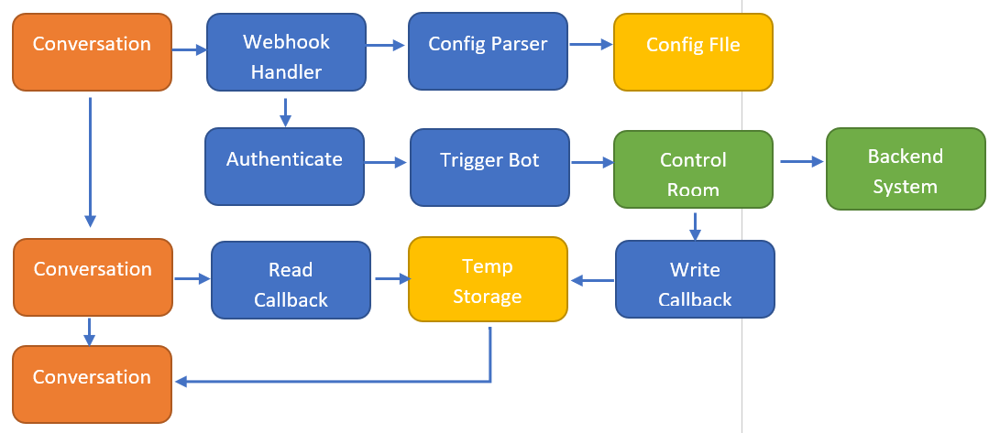
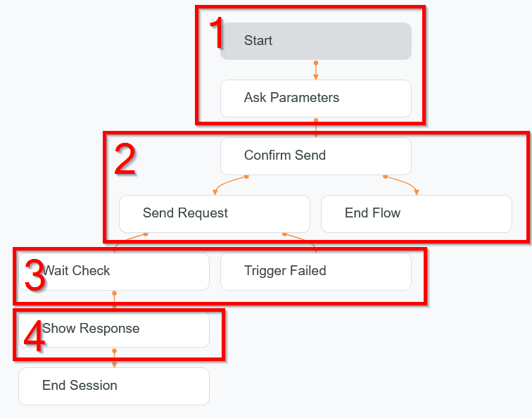
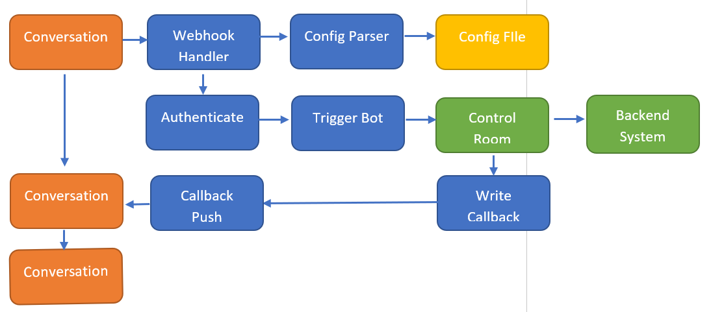

# Overview
The AAI-DialogFlow example provides a simple use case to integrate Google DialogFlow with AAI Bot. This codebase can be imported into GCP to provide a runnable starting point. 

The following GCP services are required:

- Cloud Function
- DialogFlow ES/CX
- Cloud Storage

In addition, the following are also required:

- AAI Control Room and a bot
- Chat client (such as Google Web Messenger)

The AAI-DialogFlow example showcases the following:

1. Trigger an Automation Anywhere bot from DialogFlow.
1. Pass parameters to the bot from the conversation.
1. Get results back to the conversation after the bot execution is completed.

Download the included sample bot and use it as a starting point on the CR side.
# Workflow walkthrough
## Overview
To integrate DialogFlow with Automation Anywhere, you must set up multiple Google Cloud Run scripts to act as handlers and other API endpoints. The following image provides a high-level view of the design.

The colors in the image and what they represent are as follows:

- **Orange:** Normal DialogFlow conversation
- **Blue:** Cloud Function Scripts
- **Yellow:** Cloud Storage Files
- **Green:** Control Room components



## Create a conversation
Although the exact steps to create a conversation will vary depending on each case, you can use the following steps, in general:

1. Gather information from the user.
1. Trigger the bot and get acknowledgment.
1. Continue the conversation.
1. (*Optional*) Get bot results.


## Webhook handler
Webhook handler is the entry point to trigger a cloud function that will either kick off a bot or get the result back. In either case, the process is similar:

1. Register the webhook handler.
1. Enable the handler in the step in the conversation that is needed.

To register the handler in DialogFlow, perform the following steps:

1. Under **Manage**, click **Webhook**.
1. Click **Enable** and fill out the form.
1. Click **Save**.

**Note:** The webhook URL must point to your cloud function HandlerAACR endpoint.

To enable a Webhook handler, perform the following steps:

1. Select the step in the conversation that needs the webhook.
1. Click **Entry Fulfillment** or **Routes**.
1. Scroll down to the slider for Enable Webhook and slide it to the right.
1. Select the webhook.
## Acknowledgment
After the bot is triggered, DialogFlow does not wait for the bot to complete, so you need to acknowledge to the user that the bot has been successfully triggered. If your scenario requires getting results back, you must ask the user to wait until the bot completes running. There are a few ways to do this, such as informing the user that the bot has not completed running yet and instructing the user to check back after some time. The next section will cover getting the results back in more detail.
## Get bot result
If your scenario requires getting the bot results back, it must be triggered from the user through ReadCallbackAACR to retrieve the result from a temporary storage and inject it into a conversation parameter. There is currently no built-in way to achieve push notification of the results in DialogFlow without designing a custom chat client. If you are using a built-in chat client, triggering a webhook again by the user is the only way get bot result. The results will be passed through a session variable back to the conversation after the handler is triggered. After the handler has completed, you can access your return values using this formula in the conversation and change VARIABLE\_NAME to the name of the variable for the bot:

$session.params.VARIABLE\_NAME
### Push notification of result
As previously discussed, there is no built-in way to push notifications to the Google built-in chat client currently. However, it is still possible to achieve this by building a custom front-end. The reason for this is that the existing chat client lacks any tracking of Conversation ID, and currently, there is no public, available API to get it. Google does have a private API that can achieve this, to access which you are required to request for authorization.  Conversation ID is available only when a conversation is started initially and must be saved.



You must trigger the following API to be able to receive push notification. Replace anything within double angle brackets (<<>>) with the appropriate value:

1. **Create a conversation profile:**  Trigger this API just once and save the Conversation Profile ID in a config file.
   - Use the following endpoint: [https://us-central1-dialogflow.googleapis.com/v2beta1/projects/<<Project_ID>>/locations/<<Location>>/conversationProfiles](https://us-central1-dialogflow.googleapis.com/v2beta1/projects/%3c%3cProject_ID%3e%3e/locations/%3c%3cLocation%3e%3e/conversationProfiles)
   - Access the documentation using the following link: <https://cloud.google.com/dialogflow/es/docs/reference/rest/v2beta1/projects.conversationProfiles/create>
1. **Create a conversation:** Call this API to create a new conversation every time. Save the Conversation ID that is returned so that you can refer to it later.
   - Use the following endpoint: [https://us-central1-dialogflow.googleapis.com/v2beta1/projects/d<<Project_ID>>/locations/<<Location>>/conversations](https://us-central1-dialogflow.googleapis.com/v2beta1/projects/d%3c%3cProject_ID%3e%3e/locations/%3c%3cLocation%3e%3e/conversations)
   - Access the documentation using the following link: <https://cloud.google.com/dialogflow/es/docs/reference/rest/v2beta1/projects.conversations/create>
1. **Create a participant:** Call this API every time to create a Virtual Agent participant that will read out the response. The <<Conversation\_ID>> is what was returned in step 2. Use the <<Participant\_ID>> returned in this step in the next step.
   - Use the following endpoint: [https://us-central1-dialogflow.googleapis.com/v2beta1/projects/<<Project_ID>>/locations/<<Location>>/conversations/<<Conversation_ID>>/participants](https://us-central1-dialogflow.googleapis.com/v2beta1/projects/%3c%3cProject_ID%3e%3e/locations/%3c%3cLocation%3e%3e/conversations/%3c%3cConversation_ID%3e%3e/participants)
   - Access the documentation using the following link: <https://cloud.google.com/dialogflow/es/docs/reference/rest/v2beta1/projects.conversations.participants/create>
1. **Call AnalyzeContent:** Call this API every time to send a message to the user. Push the result into the conversation in the DialogFlow engine, not the bot client. You can call this API at any time, that is, you do not need to wait for the user to ask something first. When the bot result is returned, you can call this API immediately.
   - Use the following endpoint: [https://us-central1-dialogflow.googleapis.com/v2beta1/projects/<<Project_ID>>/locations/<<Location>>/conversations/<<Conversation_ID>>/participants/<<Participant_ID>>:analyzeContent](https://us-central1-dialogflow.googleapis.com/v2beta1/projects/%3c%3cProject_ID%3e%3e/locations/%3c%3cLocation%3e%3e/conversations/%3c%3cConversation_ID%3e%3e/participants/%3c%3cParticipant_ID%3e%3e:analyzeContent)
   - Access the documentation using the following link: <https://cloud.google.com/dialogflow/es/docs/reference/rest/v2beta1/projects.conversations.participants/analyzeContent>
1. **Complete the conversation:** Call this API when the conversation ends.
   - Use the following endpoint: [https://us-central1-dialogflow.googleapis.com/v2beta1/projects/<<Project_ID>>/locations/<<Location>>/conversations/<<Conversation_ID>>:complete](https://us-central1-dialogflow.googleapis.com/v2beta1/projects/%3c%3cProject_ID%3e%3e/locations/%3c%3cLocation%3e%3e/conversations/%3c%3cConversation_ID%3e%3e:complete)
   - Access the documentation using the following link: <https://cloud.google.com/dialogflow/es/docs/reference/rest/v2beta1/projects.conversations/complete>
# Components
## Security Consideration
Cloud function allows both authenticated and unauthenticated scripts., Depending on your situation, initially test using an unauthenticated script and then set up authenticated script-runs for production. All examples shown here were tested using the unauthenticated script-run setting.
## Key.json
Some cloud functions listed have a “key.json” file in its deployment.  This file store the GCP Service Account credential used to access Cloud Storage API and DialogFlow API. For detailed instructions on how to generate this file, see the following article: <https://cloud.google.com/docs/authentication/getting-started>

Ensure that your Service Account has the correct authorization to access the required resources.
## Cloud Functions
As a way to serve API endpoints effectively, all functionality is storied in Cloud Functions.  These examples serve only as starting points and are not meant to be production-ready.
### HandlerAACR
This script will be the main entry point that will inject all functionality into the DialogFlow workflow.  This code is structured based on the Google DialogFlow handler API requirement, with both input and output being specified by the DialogFlow API. This script will call AuthenticateAACR, TriggerBotAACR, and ConfigParserAACR. Make sure that they are accessible and that the endpoint is correct.  If authenticated script-run is enabled, the authentication token must be included in the bot call signature.

- Input: DialogFlow Request Object
- Output: 200 with DialogFlow Response Object if successful; 400 with error if not successful
### AuthenticateAACR
This script authenticates with Automation Anywhere Control Room if the appropriate credential is provided and returns a login token.

- Input: None
- Output: 200 with Automation Anywhere Control Room API Authentication Token if successful; 400 if not successful
### TriggerBotAACR
This script triggers an Automation Anywhere Control Room if the correct input is provided.

You must know both the bot id and the run as user id, and not their name. To find them, view the URL in the CR of their respective pages. Currently, there is no UI from where to get the ID.

- Input: The following input parameters:
1. Authentication token: You can get it from AuthenticateAACR.
1. URL: Control Room URL
1. Bot ID: The bot ID, not bot name
1. Run As User ID: The run as user id, not run as user’s name
1. Any bot parameters: in key-value pair format
- Output: 200 with DeploymentID if successful; 400 with any error message if unsuccessful.
### ReadCallbackAACR
This script injects the Automation Anywhere bot result that is stored in the TempStorage into a DialogFlow conversation parameter, which can then be shown to the user. You can modify which parameter from the bot get saved and which one won’t by modifying the config file, under the parameter “returns”, please see the config file section for more details.Input: DialogFlow request object

- Output: DialogFlow response object
### WriteCallbackAACR
This script parse the results from an Automation Anywhere Control Room bot and saves the relevant parts to TempStorage, as specified by the “Returns” parameter. Ensure that you modify the saved information to match your bot parameter name in the config file. You may also modify the storage key, which by default is the static string “DefaultSessionID,” by default. If you change it, make sure that you also change it in the ReadCallbackAACR script. This script will be automatically called when the bot execution is completed, so make sure that this script is accessible by the Control Room. If authenticated script-run is enabled, authentication token must be included in the bot call signature when the bot is triggered in HandlerAACR.

- Input: The following parameters:
  - DialogFlow Session ID
  - Returns: Variable to be saved to TempStorage
  - Bot Outputs
- Output: 200 OK
### ConfigParserAACR
This cloud function will parse a config file in YAML format and return the information in JSON format.  You can specify the config setting here. The following configurations are possible:

- **GCP Project ID:** The project that the config file located in
- **GCP Bucket ID:** The bucket that the config file located in
- configPath: The path to the config file
- keyPath: The file that stores the key for the service account

Replace values as needed. You must know both the bot id and the run as user id, and not their name. To find them, view the URL in the CR of their respective pages.  There is no UI currently to get the ID.

- Input: None
- Output: Config file in JSON format
### TempStorageAACR
This cloud function reads and stores bot results information temporarily in your cloud storage account. The credential for the service account to access your cloud storage is stored in key.json, please ensure the service account has the right level of access.  The storage path is defined in the variable **storagePath**, be sure to modify it to match your storage setup.

- Input: The following input parameters:
  - **Action:** Read, write, or delete
  - **Key:** The key
  - **Value:** The value
- Output:
  - 200 Either the value for read or OK for write and delete
  - 404 If key is not found
  - 400 Error message
## Cloud Storage
Some files are stored in cloud storage and need to be read or written to.
### Config.yml
This file contains your Control Room credentials and bot triggering information. You must fill it out before triggering. Each conversation should have its config file so a different bot configuration can be used. The config file could be specified in the AuthenticateAACR and TriggerBotAACR cloud function.

The format is as follows
```
---
aa-cr:
  url: http://1.1.1.1/
  username: myUser
  password: myPass
  botId: 1234
  runAsUserId: 12
  returns: result1,result2
```

Here is a brief explanation of what each variable does:

1. URL: The Control Room URL
1. Username: The Control Room user that will authenticate
1. Password: The Control Room password
1. Bot ID: This is the ID of the bot that you want to run, it’s ID
1. Run As User ID: Which user to run this bot with
1. Returns: Controls which bot variables will be saved in temp storage in callback, multiple variables can be saved, simply delimit them using commas
### TempStorage.json
This file holds temporary bot results so that conversations can retrieve and display them to the user. The location of this file can be specified in TempStorageAACR Cloud Function.  For production deployment, it is recommended that you use a more secure storage solution with better concurrency control.
# Step-by-step installation
Perform the following steps to set up a ready-to-use environment.

1. Create a new project in GCP.
1. Set up a service account and give it access to Dialogflow API and Cloud Storage API.
1. Download key.json for service account.
1. Download the repository in Github.
1. Import the DialogFlow conversation into your DialogFlow CX project.
1. Import the demo bot into your CR.
1. Import each Cloud Function into Cloud Function.
1. Copy key.json into each cloud function
1. Import config.json into your Google Cloud Storage account.
   1. Modify it with your CR URL, username, and password.
   1. Modify it with your RunAsUserID.
   1. Modify it with your BotID.
   1. Modify the results line so that it matches the name of your bot output variables.
1. Modify configPath in ConfigParserAACR to point to your config file
1. Create the temp storage file in your Cloud Storage
   1. Modify storagePath in TempStorageAACR to point to your temp storage
1. Modify the following information in each Cloud Function:
   1. The project id
   1. The Cloud Function end point
1. Test and run the dialog
# Development tips
## How to test and debug
Google provides a few levels of testing, and we recommend that testing be done in the following order:

1. Ensure that the conversation work in the Simulater by clicking **Test Agent** directly in the DialogFlow CX UI.
1. Try it out in the DialogFlow Messenger in the **Integrations** tab.
1. Test it in a front end of your choice.
### Test conversation
Conversations can be tested in a front end of your choice. Here are some tips to help in debugging:

1. Each step should perform only one action.
1. Use the simulator to view the session variables.
1. You can get the entire response payload in the simulator by clicking **Original Payment**.
1. Use Console.log liberally to test the handler scripts.
1. Use the log to check the status of the scripts and receive errors.
### Test the cloud function
The Cloud function can be tested like any other REST API endpoint, using postman or a testing framework, or by directly calling it in your browser. 
## How to view log
There are a few levels of logging.

Logging for cloud functions is built in and can be accessed in the Logs tab. Use console.log to write to the log.

Conversations can be logged in Google Stackdriver, which can provide more detailed conversation information. Enable this in Agent Settings by selecting the  **Enable stackdriver logging** check box under **Logging Settings**.
# Question & Answer
## Common Problems
